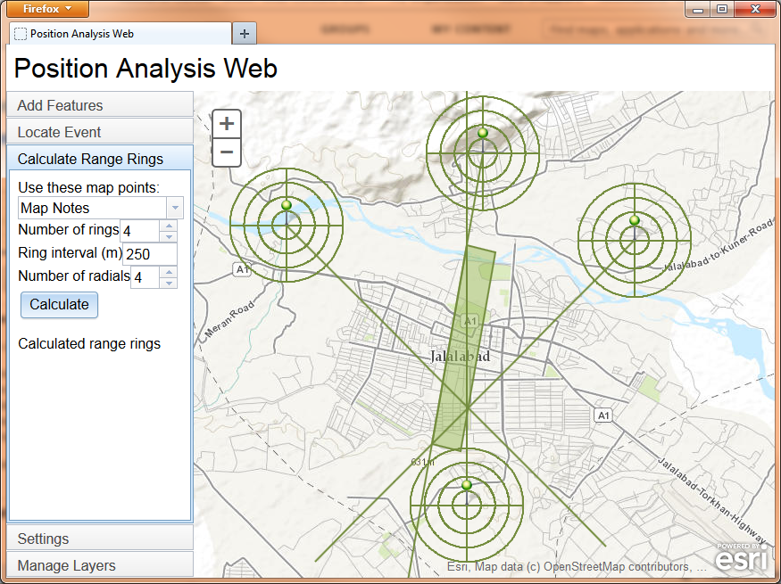

position-analysis-js
====================

[Usage](#usage)  
[Setup](#setup)  
[Licensing](#licensing)  

The Position Analysis Web template uses ArcGIS to perform position analysis in a browser. Users can select a variety of functions:

- Add features to the map via manual data entry or CSV file upload.
- Locate an event, using point features as observations.
- Calculate range rings for point features.
- Download features as a CSV file.
- Save features to a Web map.

## Usage

There are three main ways of launching the application:

1. Load the application URL in a browser with no parameters.
2. Load the application URL in a browser with a "webmap" parameter. The "webmap" parameter value should be a Web map ID for the map you want to view in the application.
3. Set up the application as a Portal Web template, as described in the help for [creating Web application templates](http://resources.arcgis.com/en/help/arcgisonline/index.html#/Creating_web_application_templates/010q00000072000000/).

The application will attempt to login to the Portal. If you are not currently logged in, the application redirects you to the Portal login page. After logging in, when the map appears, you can use all the application's tools in the following tabs:

### Add Features

Add to layer: the layer to which new features will be added.

Click Points: press this button, then click the map to add a new point to the layer.

Add point by coordinates: type a longitude and latitude, or an MGRS string, then click Add Point to add a new point to the layer.

Select Files: choose a CSV file containing features to add to the map. Alternatively, you can drag and drop a CSV onto the map. The CSV should have column headers. See the configuration variables above for specifying which column names the application will recognize. In general, here are the columns used by the application (the names are specified using the configuration variables):

- Name
- Latitude
- Longitude
- MGRS
- Geometry (specified as a JSON point, polyline, or polygon string as specified in [the ArcGIS REST API](http://resources.arcgis.com/en/help/arcgis-rest-api/index.html#/Geometry_Objects/02r3000000n1000000/)
- Azimuth (in degrees)
- Distance (in meters)

Tip: if you want to see what the CSV should look like, go to Manage Layers and download a layer, then open the CSV to see the format.
           
### Locate Event

Choose a layer containing three or more points to be used as observations for locating an observed event. Each observation should have an azimuth and a distance. Then click Locate. The geoprocessing service is called, and the estimated area of the event appears on the map, along with the observation lines calculated from each point's azimuth and distance.

### Calculate Range Rings

Choose a layer containing one or more points to be used as centers for calculating range rings. Enter parameter values:

- Number of rings: the number of range rings to calculate.
- Ring interval: the distance (in meters) between range rings.
- Number of radials: the number of radial lines to calculate.

Then click Calculate. The geoprocessing service is called, and the range rings and radials appear on the map around each point.

### Settings

Use the Settings tab to login to Portal for ArcGIS before using the rest of the application.

Click Save Map to save the feature layers. These layers are stored in a Web map.

### Manage Layers

Check the checkboxes to change layers' visibility. Click a layer name to rename that layer.

Right-click a layer name to access some actions for that layer:

- View Table: not yet implemented.
- Download Layer: this action allows you to download the data in this layer as comma-separated values (CSV). The browser gives you the option to save a CSV file. Some newer HTML5-compatible browsers offer a choice between saving a CSV file and opening the CSV file. Geometries appear in [ArcGIS REST API JSON format](http://resources.arcgis.com/en/help/arcgis-rest-api/index.html#/Geometry_Objects/02r3000000n1000000/). Point geometries also appear as latitude/longitude and MGRS. This CSV file is the type of file expected by the Add Features tool.
- Remove Layer: not yet implemented.
- Label Features: this action turns on and off labeling for the features in this layer.

## Setup

The Position Analysis Web template uses Portal for ArcGIS 10.2+ or ArcGIS Online. You'll need the portal URL in order to set up the application.

You must deploy the Web application on a HTTPS-enabled Web server, or else the login to Portal or ArcGIS Online will not work.

You must add to your Web server a MIME type for JSON. The extension is .json and the MIME type is application/json.

The file [site/defaultWebMapItem.json](site/defaultWebMapItem.json) sets up a Web map for the user when no webmapId parameter is specified and the user has no Web map called "Position Analysis Web Map." In defaultWebMapItem.json, there are various references to absolute URLs that you may need to adjust:

- Two references to marker symbol images on ArcGIS.com. If you are using Portal for ArcGIS instead of ArcGIS Online, replace both instances of "static.arcgis.com/images" with "<portal hostname>/arcgis/portalimages", substituting your portal's hostname.
- A reference to a tiled map service at http://services.arcgisonline.com/ArcGIS/rest/services/World_Topo_Map/MapServer . If you want to use a different tiled map service, replace the URL.

It is recommended to use the [the ArcGIS proxy page](http://developers.arcgis.com/en/javascript/jshelp/ags_proxy.html) provided by the portal you're using (i.e. your instance of Portal for ArcGIS, or ArcGIS Online). If you do, you will not need to change the proxyUrl variable. If you use a different proxy page, and if the Portal certificate is self-signed or issued by a non-standard certificate authority (CA), you have to configure the Web server that is hosting the proxy page to trust the certificate and/or CA. The directions for this vary based on which proxy page you choose--ASP.NET, Java, or PHP. (For example, for the Java proxy page, you must use the JDK's keytool to add the CA root certificate to the trust store of the JRE that runs your Web server.) Directions are available on the Web for various platforms and Web servers.

You need to publish the Locate Event model from the [Position Analysis Tools toolbox](https://github.com/Esri/defense-and-intel-analysis-toolbox/blob/master/toolboxes/Position%20Analysis%20Tools.tbx) as a geoprocessing service in ArcGIS 10.1 (or later) for Server. The model requires no data, so simply run it in ArcMap and publish the result. You'll use the URL of the Locate Event task as the locateEventUrl configuration variable mentioned below.

Deploy the [site](site) directory as a Web application in your HTTPS-enabled Web server with a context name of your choice. Open [site/js/pos-analysis.js](site/js/pos-analysis.js) in a text editor and edit the variables at the top of the file as necessary:

- webmapTitle: the title of the expected Web map. If the user does not own a Web map with that title, a Web map with that title will be created.
- webmapExtent: the initial extent for a Web map created by this application.
- portalUrl: the Portal for ArcGIS URL.
- sharingPath: a relative path such that portalUrl + sharingPath is the full sharing URL for the portal.
- proxyRequired: true if the ArcGIS API for JavaScript needs to use a proxy and false otherwise. A proxy is required when hosting the application on a different domain than Portal for ArcGIS and may be required in other situations. Read [the proxy page documentation](http://developers.arcgis.com/en/javascript/jshelp/ags_proxy.html) for further details.
- proxyUrl: the relative or absolute URL to the proxy page. In most cases, the default value is most appropriate.
- labelColor: the label color, expressed as a hex string (e.g. "#738C3D").
- locateEventUrl: the URL of the geoprocessing task used by the Locate Event tool.
- locateEventInputParameterName: the feature set input parameter name for the Locate Event tool.
- locateEventOutputLinesParameterName: the name of the lines output parameter for the Locate Event tool.
- locateEventOutputAreaParameterName: the name of the area (polygon) output parameter for the Locate Event tool.
- rangeRingsUrl: the URL of the geoprocessing task used by the Range Rings tool.
- rangeRingsInputRingCentersParameterName: the name of the ring centers input parameter for the Range Rings tool.
- rangeRingsInputRingCountParameterName: the name of the ring count input parameter for the Range Rings tool.
- rangeRingsInputRingIntervalParameterName: the name of the ring interval input parameter for the Range Rings tool.
- rangeRingsInputDistanceUnitsParameterName: the name of the ring interval distance units input parameter for the Range Rings tool.
- rangeRingsInputRadialCountParameterName: the name of the radial count input parameter for the Range Rings tool.
- rangeRingsOutputRingsParameterName: the name of the rings output parameter for the Range Rings tool.
- rangeRingsOutputRadialsParameterName: the name of the radials output parameter for the Range Rings tool.
- longitudeNamesUppercase: uppercase form of CSV column names that will be treated as the longitude field when uploading a CSV. Though the field names must be in uppercase in this file, the field names in the CSV may be in any case.
- latitudeNamesUppercase: uppercase form of CSV column names that will be treated as the latitude field when uploading a CSV. Though the field names must be in uppercase in this file, the field names in the CSV may be in any case.
- mgrsNamesUppercase: uppercase form of CSV column names that will be treated as the MGRS field when uploading a CSV. Though the field names must be in uppercase in this file, the field names in the CSV may be in any case.
- azimuthNamesUppercase: uppercase form of CSV column names that will be treated as the azimuth field when uploading a CSV. Though the field names must be in uppercase in this file, the field names in the CSV may be in any case.
- distanceNamesUppercase: uppercase form of CSV column names that will be treated as the distance field when uploading a CSV. Though the field names must be in uppercase in this file, the field names in the CSV may be in any case.
- titleNamesUppercase: uppercase form of CSV column names that will be treated as the title field when uploading a CSV. Though the field names must be in uppercase in this file, the field names in the CSV may be in any case.
- shapeNamesUppercase: uppercase form of CSV column names that will be treated as the shape field when uploading a CSV. Though the field names must be in uppercase in this file, the field names in the CSV may be in any case. The shape string should have the format of a JSON point, polyline, or polygon string as specified in [the ArcGIS REST API](http://resources.arcgis.com/en/help/arcgis-rest-api/index.html#/Geometry_Objects/02r3000000n1000000/).
- geometryServiceUrl: the URL of the geometry service used by the application.

Open index.html and edit the ArcGIS API for JavaScript URLs, including the JavaScript link and the CSS links. If using Portal for ArcGIS, you should use the ArcGIS API for JavaScript included with the portal.

## Licensing

Copyright 2013 Esri

Licensed under the Apache License, Version 2.0 (the "License"); you may not use this file except in compliance with the License. You may obtain a copy of the License at

   http://www.apache.org/licenses/LICENSE-2.0

Unless required by applicable law or agreed to in writing, software distributed under the License is distributed on an "AS IS" BASIS, WITHOUT WARRANTIES OR CONDITIONS OF ANY KIND, either express or implied. See the License for the specific language governing permissions and limitations under the License.

A copy of the license is available in the repository's [license.txt](license.txt) file.

Portions of this code use third-party libraries:

- USNG and Downloadify are licensed under the MIT License.
- The Ant build file uses markdown4j, which is licensed under the BSD 3-Clause License.

See [license-ThirdParty.txt](license-ThirdParty.txt) for the details of these licenses.

